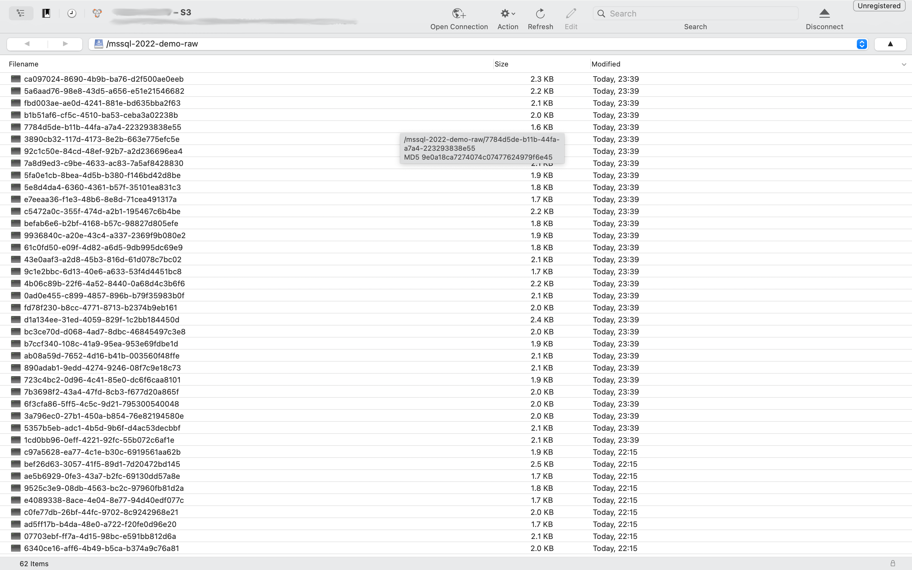
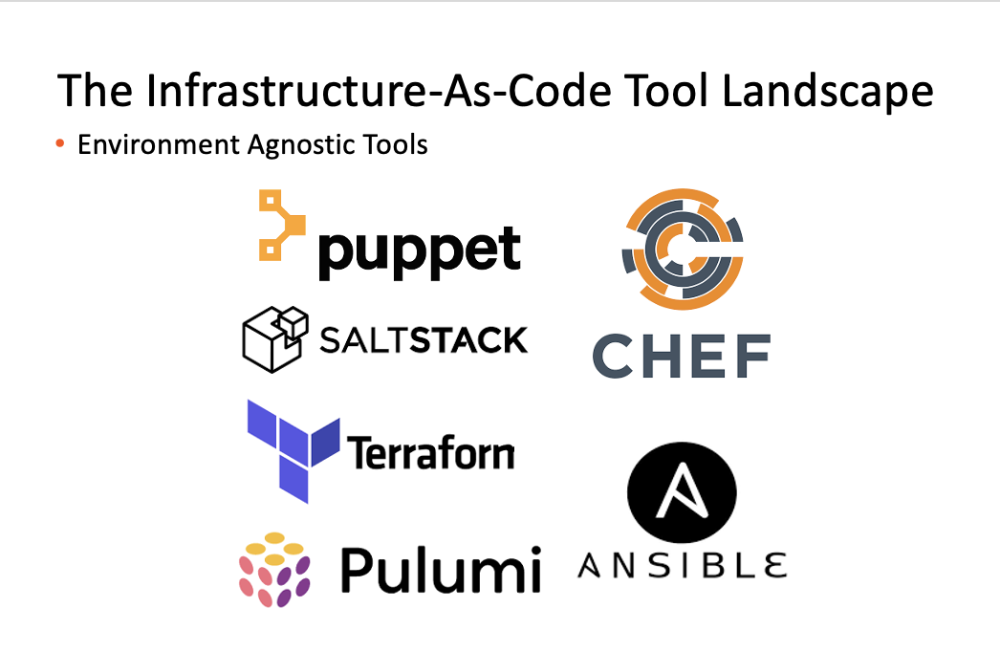
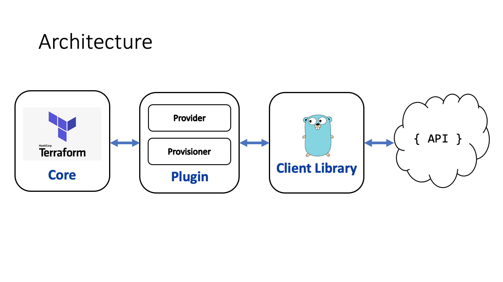
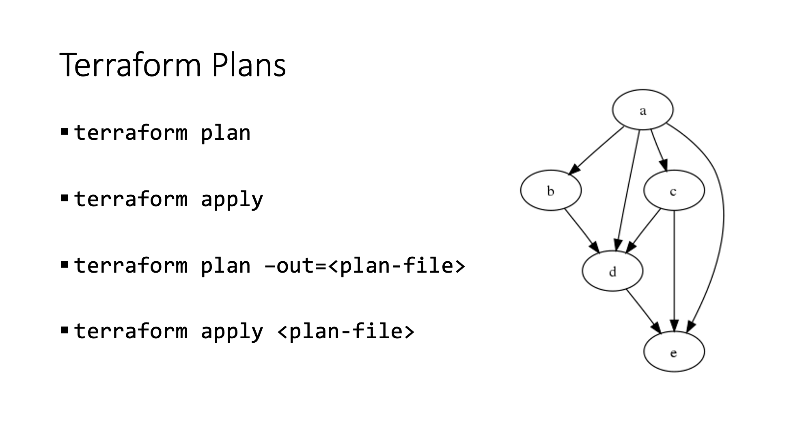

# An Introduction to Terraform

---


---

## Infrastructure-As-Code 101

<font size="6">Infrastructure as code (IaC) is the process of managing and provisioning computer data centers through machine-readable definition files, rather than physical hardware configuration or interactive configuration tools.[1] The IT infrastructure managed by this process comprises both physical equipment, such as bare-metal servers, as well as virtual machines, and associated configuration resources. The definitions may be in a version control system. The code in the definition files may use either scripts or declarative definitions . . .</font>

---

## Important Terms

- Imperitive

- Declarative

- Idempotency

- Drift

---



---


---



---

## Terraform in A Nutshell

- Comes in single executable form

- Declarative

- Stateful

- Agentless

- Written in GOLANG

---



---

## Configurations

- A configuration is the unit of deployment

- Configurations are written in Hashicorp Control Language

- Configurations consist of one or more resources

- Resources are created via providers 

---

### Main Commands

```
  init          Prepare your working directory for other commands
  validate      Check whether the configuration is valid
  plan          Show changes required by the current configuration
  apply         Create or update infrastructure
  destroy       Destroy previously-created infrastructure
```

---



---

### Configuration Building Blocks

- Providers

- Resources

- Data sources

---

## A Basic Provider

```
provider "kubernetes" {
  config_path    = "~/.kube/config"
  config_context = "my-context"
}
```

---

## Providers With Aliases

```
provider "kubernetes" {
  alias          = "dev"
  config_path    = "~/.kube/config"
  config_context = "dev-context"
}

provider "kubernetes" {
  alias          = "test"
  config_path    = "~/.kube/config"
  config_context = "test-context"
}
```

---

## A Basic Resource
```
resource "kubectl_manifest" "arc_sql_mi" {
  .
  .
  .
}
```

---

## Resource With A Provisioner 
```
resource "kubectl_manifest" "arc_sql_mi" {
  .
  .
  .

  provisioner "local-exec" {
    command = "This is a local provisioner"
  }
}
```

---

## Adding a Depends On Clause
```
resource "kubectl_manifest" "arc_sql_mi" {
  .
  .
  .

  provisioner "local-exec" {
    command = "This is a local provisioner"
  }

  depends_on = [
    kubernetes_secret.arc_sql_mi_login_secret
  ]
}
```

---

## Null Resources

```
resource "null_resource" "hand_crafted" {
  provisioner "local-exec" {
    command = "This is a local provisioner"
  }

  provisioner "local-exec" {
    when    = destroy
    command = "On destroy provisioner"
  }
}
```

---

## Data Sources
```
data "http" "all_yml" {
  url = "https://raw.githubusercontent.com/. . ./all/all.yml"
}

resource "local_file" "all_yml" {
  content  = replace(data.http.all_yml.body, "/#", ""))
  filename = "./all.yaml"
}
```

---

## Input Variables

Can be:

- specified as environment variables prefixed by TF_VAR_

- specified as defaults in variables definition files

- specified in .tfvars files, variable from terraform.tfvars are always loaded by default

- simple or complex, e.g. maps and nested maps

---

## Variable Constraints

```
variable "image_id" {
  type        = string
  description = "The id of the machine image (AMI) to use for the server."

  validation {
    # regex(...) fails if it cannot find a match
    condition     = can(regex("^ami-", var.image_id))
    error_message = "The image_id value must be a valid AMI id, starting with \"ami-\"."
  }
}
```

---

## Interpolation

```
  yaml_body = <<YAML
kind: PersistentVolumeClaim
apiVersion: v1
metadata:
  name: test-pvc
spec:
spec:
  accessModes:
  - ReadWriteOnce
  resources:
    requests:
      storage: ${var.pvc_size}
  storageClassName: ${var.storage_class}
YAML
```

---

## State

- Stored in a local file by default

- Can also be stored in most object stores or Terraform cloud

- Can be imported

- **Do not lose the state of your configuration(s) !!!**

---

## Backends

```
terraform {
  backend "azurerm" {}
}

data "terraform_remote_state" "state" {
  backend = "azurerm"
  config {
    resource_group_name  = var.resource_group
    storage_account_name = var.storage_account
    container_name       = var.storage_container
    key                  = var.storage_account_key 
  }
}
```

---

## Modules
```
parent module 
             main.tf
             variables.tf
             values.tfvars +------ Child module (A)
                           |                       main.tf
                           |                       variables.tf 
                           |
                           +------ Child module (B)
                           |                       main.tf
                           |                       variables.tf 
                           |
                           +------ Child module (C)
                                                   main.tf
                                                   variables.tf 

terraform apply -target=module.module_a

terraform apply -target=module.module_a.resource_a
```

---

# Hands-On Tutorial Exercises

---

## Tutorial Exercises - Prerequisites

To try these out on your laptop, you will need:

- [minikube](https://minikube.sigs.k8s.io/docs/start/)

- [Terraform](https://learn.hashicorp.com/tutorials/terraform/install-cli)

---

## What We Will Cover

- 1: namespace creation
- 2: namespace creation with variables
- 3: PVC creation with a third party provider
- 4: PVC creation using a for loop
- 5: template usage

---

## Terraform Vs Ansible

|Feature|Ansible|Terraform|
|-------|-------|---------|
|Unit of deployment|Playbook|Configuration|
|Main focus area|Configuration management|Orchestration|
|Declarative/Imperitive|Imperitive|Declarative|
|Deployment language|YAML|HCL|
|Stateful|No|Yes|
|Codeless resource destruction|No|Yes|
|Agentless|Yes|Yes|

---
# Best Practices
---

## Provisioners

- [Provisioners are a last resort](https://www.terraform.io/language/resources/provisioners/syntax)

- Plans cannot be produced for provisioners

- To undo the action of a provisioner, a destroy provisioner must be written

- Variables cannot be used inside of destroy provisioners

---

## .gitignore files
```
**/.terraform/*
*.tfstate
*.tfstate.*
crash.log
crash.*.log
*.tfvars
override.tf
override.tf.json
*_override.tf
*_override.tf.json
*tfplan*
.terraformrc
terraform.rc
```

---

## Miscellaneous 

- Use a backend to securely store state

- Prefer the use of templates, regex and replace functions
  to embedding sed, awk or perl in configurations

---

### Advanced Topics

- [Mono repo Vs. Multi repo](https://www.hashicorp.com/blog/terraform-mono-repo-vs-multi-repo-the-great-debate)

- [Terragrunt](https://terragrunt.gruntwork.io/)

- [Terratest](https://terratest.gruntwork.io/)

- [Implementing providers](https://www.hashicorp.com/resources/creating-terraform-provider-for-anything) 

- [GitOps and Terraform](https://www.hashicorp.com/resources/gitops-and-terraform-enterprise-a-match-made-in-heaven-at-state-farm)

- [Hashicorp recommended workflows](https://www.terraform.io/cloud-docs/guides/recommended-practices)  
