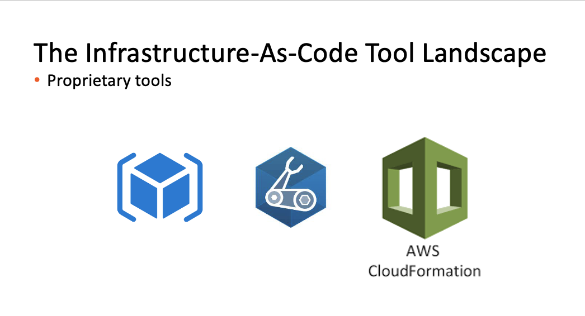

# Cloud Native Data Pipelines 

---

## Aims

Showcase Portworx PDS (database-as-a-service on Kubernetes) via some simple cloud native data pipelines

---

## Technology Stack

- Portworx Data Services (underpinned by Portworx Enterprise)

- S3

- Python

- Twitter Tweepy V2 API

- Argo Workflows using the container WorkflowTemplate

- Kubernetes
---

## A Picture Paints a Thousand Words

---

